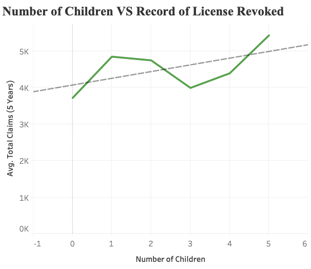
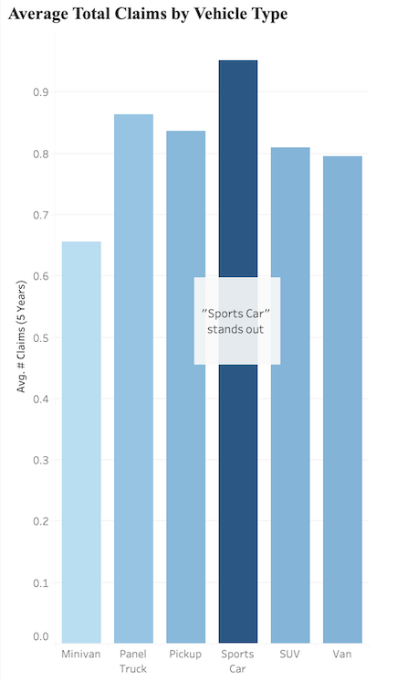

# Understanding Your Customers 
> Guide for entering auto insurance industries through analysing auto insurance company data.
> 
> Presented By: Brenna Yin, Yijun Yang

## Table of Contents
1. [Backstory](#backstory)
2. [Data Overview](#Data-Overview)
   - Features and Claims
   - Customers Profile
   - Scoring System
3. [Selecting Important Features](#Important-Features)
   - The Importance of Using Categorical Features
   - From Numerical to Categorical – Age, Points Taken, Number of Children
   - From Complexity to Simplicity – Vehicle Type
   - Binary Features – License Revoked, Vehicle Use
4. [Analyzing Zero Claim Customers](#Analyzing-Customers)
5. [Takeaway](#Takeaway-Scoring-System)
   - Final version of Scoring System
   - Validation
7. [What's Next](#Whats-Next)

## Backstory

When I bought my first car, I realized that auto insurance is no longer the advertisement I see on the billboards standing besides the freeways. It became a product that I am required to purchase and it needs to be chosen carefully. 

Being an ordinary customer, insurance is a necessity along with my car. A car must come along with its insurance. That grows billions of auto insurance markets today in the U.S. 

I got my first quote from an insurance company that works with my car’s dealership after filling a really long and detailed questionnaire. I told them basically everything about myself, my age, my education level, my citizenship, my salary, my marriage history/status, the number of children I have. Providing so much personal information just because I want to get the insurance for my car and myself with the lowest price.  At one point, I even filled out my undergrad GPA so that I could get a lower price for being a well-behaving person in academics.

We can see from that it is true that insurance companies have the closest access to the data which associates with people’s mundane life.

Getting to know the auto insurance industry helps us understand our life and the reality of the world we live in. 
Please continue reading if you are now one of these followings:
> someone just entering auto insurance field 
>  
> someone thinking about entering auto insurance field
>  
> someone who want to know about auto insurance with reality data

Entering the auto insurance industry, means we are dealing with highly personal information. Auto insurance industry exists to accommodate customers’ needs so people could drive legally with responsibility for others and themselves. Those companies are large, convoluted mechanics dealing with complex reality problems every day. 

But luckily, there is an easier way to get to know this big machine by directly looking at the data from it. Such a scenario above about getting a quote is extremely common and it provides massive data for auto insurance companies. 

Before data mining, we need to be aware of some **key questions** in the insurance industry:
>   Will this potential customer file a claim?
> 
>   Will this new customer file a claim? 
> 
>   Will this old customer file a claim?
>    
>   Will this old customer file a claim again?
    
Clearly, the critical point here is to file a claim or not for a customer. That is, frankly, the top question insurance companies are concerned with. Regardless of the fields. So as a “green-hand” in this field, it is a good idea to know ***first*** how to identify the filing risk of customers based on their provided personal information.

**That is, how to classify the customers?**

We here suggest you to do that through the company data. With some data mining, we could know
1. What a modern auto insurance industry looks like
2. What are customer profiles for an auto insurance company
3. How to evaluate the customers with certain risk scores

They are sufficient for starting to know this industry and are helpful to build your own journey later. 

#### * *Ethical Reminding* *
Just like credit scores, insurance information is highly personal and holds privacy because of its intrinsic characteristic.
When you have access to any insurance data, you should not disclose that private information to unauthorized parties.
You must refrain from publishing data that contains personally identifiable information (PII). Remember that PII can also include information that allows a person's identity to be inferred.
Keep all these in mind, let’s start to take a look at an auto insurance company data. 

## Data Overview
The sample data we are looking at comes from a five year claim history from an actual auto company. (data link: )
The tools we used to analyze and present our data are python and tableau. 

### Features and Claims
Usually, the data from an auto insurance company is massive. To better understand such a large volume of data, we divide the data into three groups:

1. Features describing the vehicles: type, color, usage, value, etc. 
2. Features describing the drivers: age, occupation, education, gender, # of children they have, income, home value, etc.
3. Information about the claim: claim or not, number of claims, amount of claim. 

In our sample data:
 > The total claim amount in five years for this company is `$11.33M`, with an average claim amount `$1481`.
 > 
 > The total number of claims in five years is `6046 claims`, with an average number of claims `0.79`. 
 > 
From above calculation results, we could see that the amount of money being processed is large and the frequency of filing claims happens very often (even more often than you thought).

### Customers Profile
Customers are the core of an auto insurance company. The composition of our customers decides the future of the company to a great extent.  We would like to have a picture of our customers profiles thus knowing better about our market.

Doing analysis in three leading fields: gender, education level, ages; we find no highly-biased distribution in any field.

In all three diagrams, the percentage distribution is rather even and aligning with our common sense. There is no such group of people with features that company favors over other groups. 

### Scoring System

As we mentioned before, the top thing for a “green-hand” in this industry is to know whether this customer will file a claim. Identifying risky customers saves your time and energy, especially at the beginning of your career. 

However, we conclude from the last part in examining customer profiles that there are no naturally grouped customers from our data. So what we need to do now is linking the customer data (both associated with vehicles and drivers) with the claim data. Such cross analysis gives us an idea of a much more preferred customer profiling.

To quantitatively evaluate such customer profiles, we developed our scoring system. This is a way to classify customers according to how risky they are. Being high risk means this customer is more likely to file a claim than others. We assume that high risky customers share some extent of the same features and it is possible to find those specific features from deeper data analysis. 

Remember that there are over 15 features from the data and it will be time consuming if we take all features into account. Instead, we just select a few of them to build our scoring system. If a customer falls into one feature, then he/she gets one risky score.
Higher score, more “risky” in filing a claim the customer is. Vise Versa.

Here is an example with some selected features:
*Note that here are just example features for illustration use.*
*Does not represent the final findings in our actual scoring system.*

In this example, this customer has 3 out of 5 scores. So he is in a mid-risky range. 

One important and major goal here is finding these specific selected features in building a reasonable and valid scoring system for classifying customers. 

## Important Features

### To Begin with – The Importance of Using Categorical Features
In our scoring system, we especially pick six important variables. We chose these features based on several rules. First, these features should be significantly related to classify our clients. We also chose our features wisely expecting that we could lower our budget when running our business in the practice. Thus, we want our features to be simple enough to process. That is, we need simple-enough categorical features in forming our scoring system. The logic behind it is easy to understand. In practice, we need to collect this information from our customers to score our clients. Then it is much easier to get the right answer when asking “is your vehicle value above $10000” rather than asking “How much does your vehicle value”. On the other hand, it is also easier for the computer to process categorical data rather than numerical data. Using categorical data would largely save our opportunity cost.
 
In conclusion, we do not just want our features qualified for the scoring system. We also want them to be simple enough to deal with. Categorical features with two or three categories would be perfect choices. Based on these criteria, we chose six features to form our scoring system and transformed them into simplified categorical features if necessary.

### From Numerical to Categorical – Age, Points Taken, Number of Children
We have three features that are transformed from numerical features: the insured's age, the points taken from the license, and the number of children that insureds have.

Above is a graph that plots the average number of claims and total claim amount in each age group. There is an interesting phenomenon here that the relationship between claims and age has different patterns when insureds are in the young, middle-aged, or the elder groups. You could tell from the graph that when the insureds are younger than 30 or older than 60, both the average number of claims and total claims present an erratic pattern. You may also notice that bars or points in these two areas are generally higher than those in the 30 to 60 area. Both appearances indicate that insureds under 30 or above 60 are potentially “riskier” than insureds between 30 and 60. The proof is also revealed in the graph that bars and lines are relatively stable between 30 and 60. Based on the above pattern, instead of recording the specific age of our customer, we choose to classify them into three different age groups: “young” as under 30, “Middle” as 30 to 60, and “Elders” as insureds older than 60.

We also find out that points taken from clients’ licenses is a powerful character. Here is another graph that plots the relationship between the average total claims and the points taken from the license. Notice the sudden drop at point 12. We may notice that when the points being taken are less than 12 (including 12), the difference between bars is not noticeable. Considering that we are analyzing 5-year total claims, the difference would be even smaller when spreading the difference into each year. Thus, we may conclude that only insureds that have taken more than 12 points are riskier than the other groups. The graph indeed indicates that these insureds reported higher historical total claims. We also applied 0 as another threshold since no matter what insureds have no points taken is still different from those who have points taken before. This threshold is chosen based on common sense.

We also analyzed the number of children reported in clients’ families. Unfortunately, this time the graph did not give us an obvious clue on how we should process our data. The difference between each point is minor and the trend line is almost horizontal. Therefore, this time we decided to divide our customers purely based on common sense. A common American family usually has three children or less, so we choose 0 (0 is always important) and 3 as our threshold in this case.
 
At this point, you may come up with a question: does our classification really work? Especially that we sometimes used common sense instead of robust analytic evidence. Well, the visualizations tell us that they indeed work.

Here are the bar plots for the three transformed categorical features. You may notice how both the average number of claims and total claims reveal notable differences among groups. Such patterns give us confidence that our transformation is valuable.

### From Complexity to Simplicity – Vehicle Type
Other than numerical features, we also have complicated categorical features that needs to be simplified. That is, the insured's vehicle types.

This feature originally classified out customer as six different categories: minivan, panel truck, pickup, sport car, SUV and van. We also made a bar plot for these six different vehicle types. You may notice that besides “sports car”, all other bars present similar height and color. Such pattern indicates that only clients that have insured a sports car imply a higher risk of filing a claim. In other words, in order to simplify our feature, we do not need to record each customer’s detailed vehicle type. Instead, we may just record our customers if their vehicle is a sports car or not.
 
### Binary Features – License Revoked, Vehicle Use
We also pick two binary features that do not need further processing since they are already simple enough. One of these features show if the insureds’ licenses have been revoked in the past seven years. The other one classifies insureds based on how they use their vehicles. If they are recorded as “private”, it means that vehicles are personally used; if they are marked as “commercial”, it means their vehicles are for business purpose. These two binary features, together with the four transformed features make up our scoring system.

## Analyzing Customers

In order to use our features to form a reliable scoring system, we first must understand our customers. We need to know who are more likely to file a claim and who are not. Thus, we tried to “describe” customers that have never filed a claim before by using our chosen features.

// insert pic

According to these donut charts, it is easy to notice that these clients share similar attributes. In other words, to “describe” insureds that are less likely to file a claim, most of them are using vehicles for private reason, have no record that their license been revoked in the past seven years, and not using a sports car; Most of them are aged between 30 and 60, have no children and have no points been taken from their licenses.
 
Based on the above analysis, we may conclude that for each individual customer, the more he or she fits the above description, the less likely they will file a claim in the future. Therefore, we could “score” our customers based on how much they fit the description of no-claim customers. The higher the score, the “riskier” they are.

## Takeaway: Scoring System
### Final version
Taken the results from customers with zero claims, we finally developed our complete scoring system with these following selected features:

//insert pic

For each of those six carefully selected features, the customer will get one risky point if he/she satisfies the red colored criteria, and zero risky point if he/she satisfies the green colored criteria. 

**Higher score, more likely to file a claim.**

**Lower score,  less likely to file a claim.**

### Validate the final version of scoring system
How well does our system work? Let’s examine it again with full company data, especially against the number of claims and amount of claims. 

//insert pic

//insert pic

According to both two bar charts, there is an obvious positive relationship between risky score and number of claims/claim amount. 

Higher risky scores cause a larger average number of claims, especially when the customer gets 6 points out of 6. 
Higher risky scores also lead to more expensive claim bills. Group of Score 5 has a claim amount of `$903.2` which is more than twice of Score 2’s average claim amount (`$355.9`).

Someone might notice there is a drop in average claim amount when the risky score is as high as 6. That is because this bar chart shots the average claim amount. The cases where customers scored a total of 6 points are rare so the average claim amount is rather low. It is worth noticing that the average number of claims, meaning how likely this person will file a claim, is obviously the largest (`0.6`) for score 6 customers.

## What’s next
Auto insurance companies today are closely associated with large volumes of data. What we present today did not fully utilize the data. Instead, we just pick the part that could help people who are just entering this field to the greatest extent. We hope this analysis will give you some inspiration on your work later in this field. 

Now you can understand your market and policyholders better, both quantitatively and qualitatively. That ensured adequate coverage for those people and thus providing better customer care. Such understanding also prevents insurance fraud from the company level and further leads to high efficient processing and finally makes more money. 

The real world is harsh and more complex, outliers do happen from time to time. The rules obtained from data are changing because people are changing with time. Data is helpful in helping you get a big picture and predicting the trends. However, completely relying on data might lead to overconfidence and ignoring customer’s requirements and actual needs.
